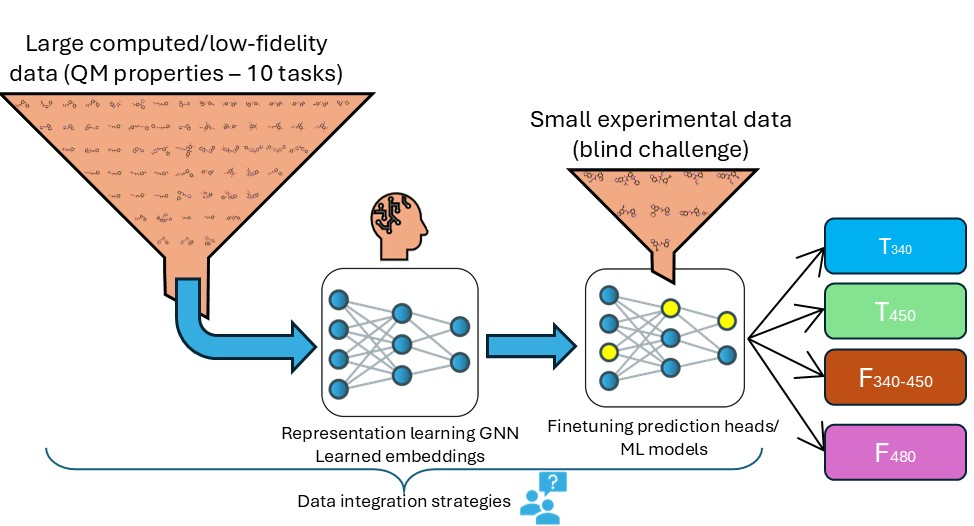

# Quantum properties-based multitask transfer learning for enhanced Transmittance and Fluorescence prediction

Code and entry report for the EU-OPENSCREEN-SLAS machine learning challenge ([EUOS25](https://www.eu-openscreen.eu/resources/eu-openscreen-news/ansicht/eu-openscreen-and-slas-launch-the-second-joint-machine-learning-challenge.html)). The challenge's main task is to predict whether molecules exhibit Absorption or Fluorescence at specific wavelengths.

The entry was ranked 3rd in Absorption and 7th in Fluorescence on the blinded test set leaderboard, using a relatively simple QM properties-based multitask transfer learning.

### Model overview

The entry's main idea was to repurpose the various publicly available QM datasets (such as QMugs, QM40, and PCQM4Mv2) to pretrain a GNN model for representation learning in a multitask manner. The QM datasets were filtered with a chemical similarity threshold to the challenge's data, and various properties (HOMO-LUMO gap, Molecular polarizability, Vibrational entropy, etc.) were selected for multitask pretraining.

The curated pretraining dataset comprised ~750k molecules and 10 tasks (10 properties from three dataset sources).

After pretraining, for each of the challenge endpoints, 10 models (each with a newly initialized classification head) were finetuned from the base pretrained model. BCE Loss with balanced weights for the minority class was used to finetune models. For severely imbalanced endpoints (“Transmittance 450”, “Fluorescence >480”), dataset subsetting strategy was also used when finetuning models. The final probability prediction is the mean of the fine-tuned models for each endpoint.

### Installation 
Install [Pytorch Geometric](https://pytorch-geometric.readthedocs.io/en/latest/notes/installation.html), and then other packages specified in `requirements.txt`

### Usage
* [Challenge result reproduction](notebooks/Submission_Reproduction.ipynb) | Notebook to download models and reproduce predictions
* [Model weights download](https://huggingface.co/datasets/longhung25/EUOS25_challenge/resolve/main/finetuned_models_submission.zip)
* [Report with references](https://docs.google.com/document/d/1cIZIFsQ_eU8DaWAC1mVd4maxDkgG0Z86qKRjSAYOas0/edit?usp=sharing)